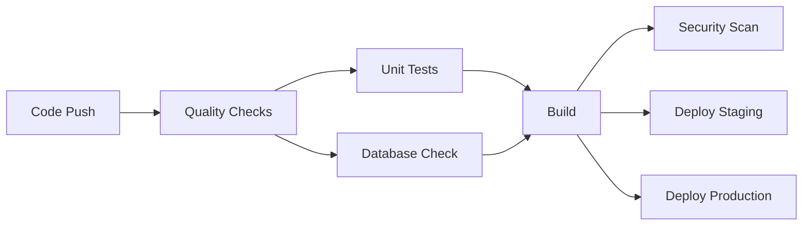
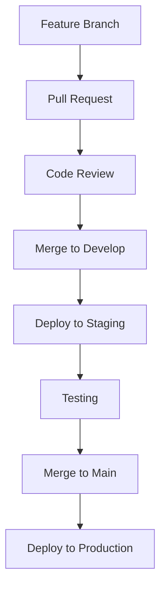

# DevOps & CI/CD Documentation

## 🚀 Overview

This document outlines the DevOps setup for the B2B Plateforme project, including CI/CD pipelines, testing, deployment, and monitoring.

## 📋 Table of Contents

- [CI/CD Pipeline](#cicd-pipeline)
- [Testing Strategy](#testing-strategy)
- [Deployment](#deployment)
- [Docker Configuration](#docker-configuration)
- [Monitoring & Security](#monitoring--security)
- [Environment Management](#environment-management)

## 🔄 CI/CD Pipeline

### GitHub Actions Workflow

The CI/CD pipeline is configured in `.github/workflows/ci-cd.yml` and includes:

#### Jobs:
1. **Quality Checks** - ESLint, TypeScript, Security audit
2. **Unit Tests** - Jest tests with coverage reporting
3. **Build** - Next.js application build
4. **Database Check** - Migration validation
5. **Deploy Staging** - Automatic deployment to staging (develop branch)
6. **Deploy Production** - Automatic deployment to production (main branch)
7. **Security Scan** - Trivy vulnerability scanning

#### Triggers:
- Push to `main` or `develop` branches
- Pull requests to `main` or `develop` branches

### Pipeline Stages



## 🧪 Testing Strategy

### Test Types

1. **Unit Tests** - Component and utility function testing
2. **Integration Tests** - API endpoint testing
3. **E2E Tests** - Full user journey testing (future)

### Test Configuration

- **Framework**: Jest + React Testing Library
- **Coverage Threshold**: 70% for all metrics
- **Test Files**: Located in `__tests__/` directory
- **Setup**: `jest.setup.js` for global test configuration

### Running Tests

```bash
# Run all tests
npm test

# Run tests in watch mode
npm run test:watch

# Run tests with coverage
npm run test:coverage

# Run tests for CI
npm run test:ci
```

### Test Examples

- **Component Tests**: Button, Input, Chat components
- **Utility Tests**: Utility functions, helpers
- **API Tests**: Authentication, chat endpoints
- **Integration Tests**: Database operations

## 🚀 Deployment

### Deployment Platforms

#### Vercel (Recommended)
```bash
# Automatic deployment on push to main
# Configure in Vercel dashboard:
# - Connect GitHub repository
# - Add environment variables
# - Set build command: npm run build
```

#### Docker Deployment
```bash
# Build Docker image
docker build -t b2b-plateforme .

# Run with docker-compose
docker-compose up -d

# Or run standalone
docker run -p 3000:3000 b2b-plateforme
```

### Environment Variables

Required environment variables for production:

```bash
# Database
DATABASE_URL="postgresql://..."

# Authentication
NEXTAUTH_URL="https://your-domain.com"
NEXTAUTH_SECRET="your-secret"

# Stripe
STRIPE_SECRET_KEY="sk_live_..."
STRIPE_PUBLISHABLE_KEY="pk_live_..."

# Ably
NEXT_PUBLIC_ABLY_API_KEY="your-ably-key"

# Email
EMAIL_SERVER_HOST="smtp.yourdomain.com"
EMAIL_SERVER_USER="noreply@yourdomain.com"
EMAIL_SERVER_PASSWORD="your-password"
EMAIL_FROM="noreply@yourdomain.com"
```

## 🐳 Docker Configuration

### Dockerfile

Multi-stage Docker build optimized for production:

1. **Dependencies Stage** - Install production dependencies
2. **Builder Stage** - Build the application
3. **Runner Stage** - Create minimal production image

### Docker Compose

Local development setup with:
- PostgreSQL database
- Redis cache (optional)
- Application container

### Usage

```bash
# Development
docker-compose up -d

# Production build
docker build -t b2b-plateforme .

# Run production container
docker run -p 3000:3000 b2b-plateforme
```

## 🔒 Monitoring & Security

### Security Measures

1. **Dependency Scanning** - npm audit in CI pipeline
2. **Vulnerability Scanning** - Trivy security scanner
3. **Code Quality** - ESLint and TypeScript checks
4. **Environment Security** - Secrets management via GitHub Secrets

### Monitoring Tools

#### Recommended Integrations:
- **Sentry** - Error tracking and performance monitoring
- **Vercel Analytics** - Built-in analytics for Vercel deployments
- **Uptime Robot** - Uptime monitoring
- **LogRocket** - Session replay and debugging

#### Health Checks:
- Application health endpoint
- Database connectivity
- External service availability

## 🌍 Environment Management

### Environments

1. **Development** - Local development
2. **Staging** - Pre-production testing (develop branch)
3. **Production** - Live application (main branch)

### Branch Strategy

- `main` - Production branch
- `develop` - Staging branch
- `feature/*` - Feature branches
- `hotfix/*` - Hotfix branches

### Deployment Flow



## 📊 Metrics & KPIs

### CI/CD Metrics
- Build success rate
- Test coverage percentage
- Deployment frequency
- Mean time to recovery (MTTR)

### Application Metrics
- Response time
- Error rate
- User engagement
- System uptime

## 🛠️ Troubleshooting

### Common Issues

1. **Build Failures**
   - Check TypeScript errors
   - Verify all dependencies are installed
   - Ensure environment variables are set

2. **Test Failures**
   - Update test mocks
   - Check test environment setup
   - Verify test data

3. **Deployment Issues**
   - Check environment variables
   - Verify database connectivity
   - Check external service availability

### Debug Commands

```bash
# Check build locally
npm run build

# Run tests locally
npm test

# Check Docker build
docker build -t test .

# Check logs
docker-compose logs app
```

## 📚 Additional Resources

- [Next.js Deployment](https://nextjs.org/docs/deployment)
- [GitHub Actions](https://docs.github.com/en/actions)
- [Docker Best Practices](https://docs.docker.com/develop/dev-best-practices/)
- [Jest Testing](https://jestjs.io/docs/getting-started)
- [Prisma Deployment](https://www.prisma.io/docs/guides/deployment)

## 🤝 Contributing

When contributing to the project:

1. Create a feature branch from `develop`
2. Write tests for new functionality
3. Ensure all tests pass
4. Create a pull request
5. Wait for CI/CD pipeline to complete
6. Address any review feedback
7. Merge after approval

## 📞 Support

For DevOps-related questions or issues:
- Check the troubleshooting section
- Review CI/CD pipeline logs
- Consult the deployment documentation
- Contact the development team
